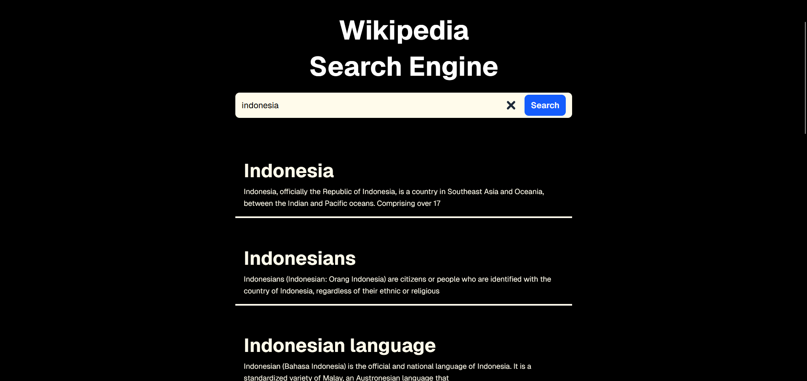

# Wiki Search Engine

A simple full-stack search engine app to retrieve Wikipedia articles. Built with a Go (Golang) backend paired with Next.js and TypeScript frontend.

## Tech Stack

**Backend:**
- Go (Golang)
- Gin Web Framework
- Wikipedia API integration

**Frontend:**
- Next.js 
- TypeScript
- Tailwind CSS

## Main Features
- Search Wikipedia articles
- Display search results linked to the wikipedia article
- Pagination

## Project Structure

```
├── backend/
│   ├── main.go              # API server with Gin
│   ├── service/service.go   # Wikipedia API calls
│   ├── entity/response.go   # Response models
│   └── go.mod
└── frontend/
    ├── app/
    │   ├── page.tsx         # Main search page
    │   ├── layout.tsx       # Layout wrapper
    │   └── globals.css
    ├── components/
    │   ├── Search.tsx       # Search bar component
    │   ├── SearchResult.tsx # Single result component
    │   ├── SearchResultList.tsx # Results container
    │   └── Pagination.tsx   # Pagination controls
    ├── lib/api.ts           # API fetch helper
    ├── types/index.ts       # TypeScript types
    └── package.json
```

## Notes

This project is for training and portfolio purposes.

## Screenshot Preview

